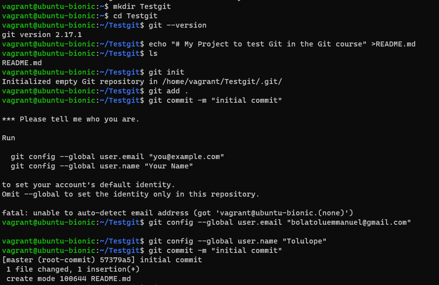

# **Step 1: Initiailizing Repository**

# **Step 2: Branching and Merging**

# **Step 3: Remote Repository**

# _Created a new repository on github,then linked the local and remote repo_

# **Step 4: Collaboration and Pull Requests**

# After successfully cloning the repository, i forked the repo i.e Bazil-build and then created a pull request

# **Step5: Adding SSH Keys**

